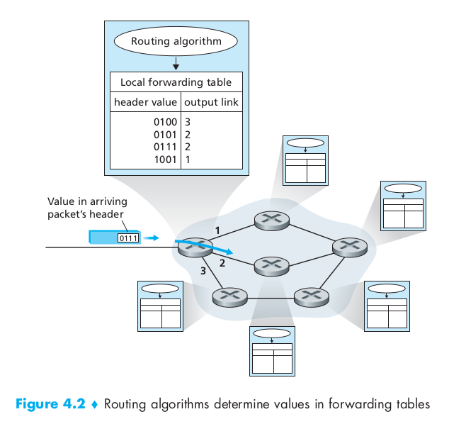
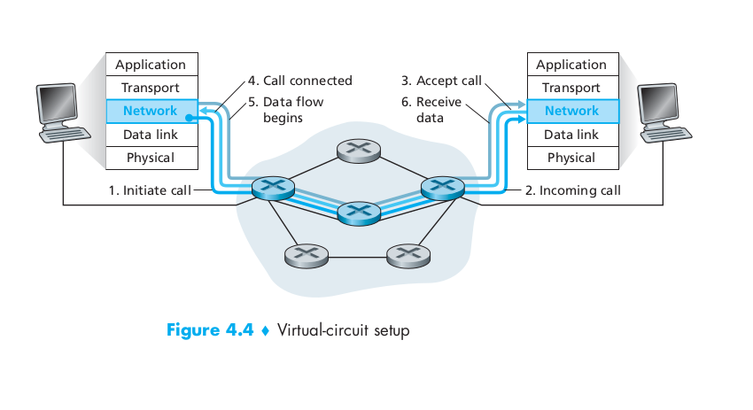
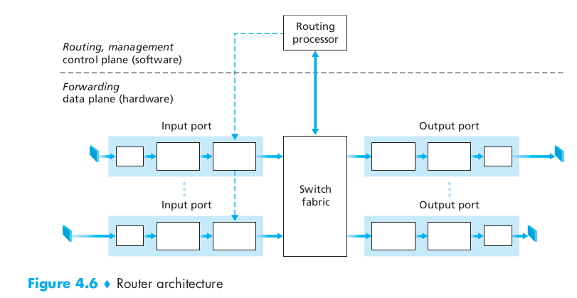
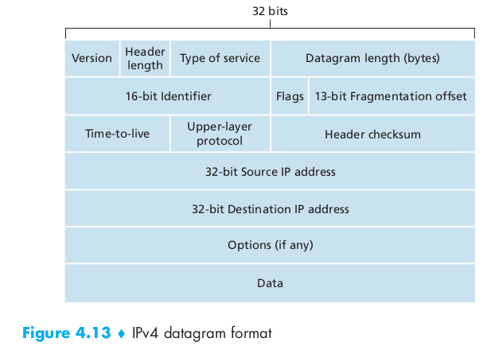
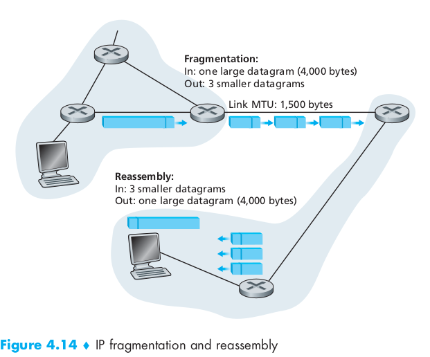
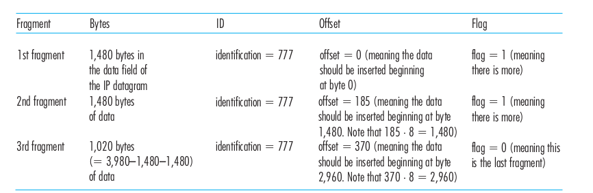
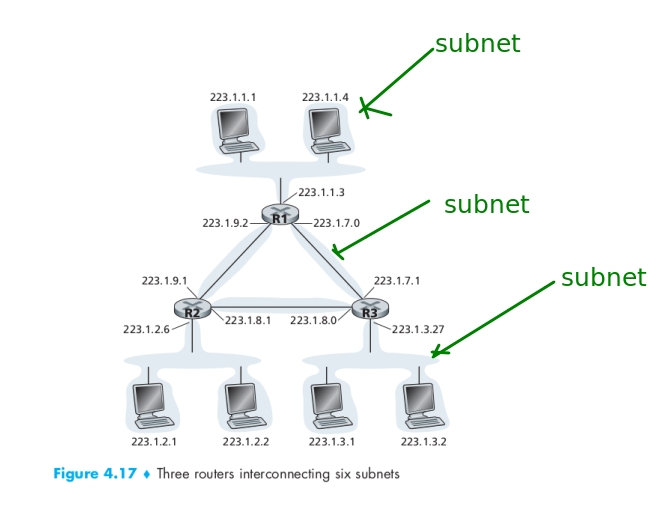

# Unit 5 Network Layer 

Switches - link layer devices
Routes - network layer devices 
Forwarding Table

## Forwarding table 
- Router has forwarding table
- A router forwards packet by examining the value in header field  of arriving packet 
- Use this header value to index into the router’s forwarding table. 
- In table, value for that header indicates the router’s outgoing link interface to
which that packet is to be forwarded. 
- Depending network-layer protocol,the header value could be the destination address or an indication of connection to which the packet belongs.

## Virtual-circuit and datagram

| **Virtual-circuit (VC)networks**                                                                                                                  	| **Datagram Networks**                                                                                                                         	|
|---------------------------------------------------------------------------------------------------------------------------------------------------	|-----------------------------------------------------------------------------------------------------------------------------------------------	|
| Host to host i.e handshaking                                                                                                                      	| Connection service                                                                                                                            	|
| VC setup: Each time a new connection is establish ,  new connection entry in forwarding table , Connection is released, entry removed from table. 	| No VC setup Each time end system when sends a packet It stampas packet with destination(end system) address Maintain info in forwarding table 	|
| Light headed                                                                                                                                      	| Over headed                                                                                                                                   	|
| **signaling protocols:** Message protocol for - sending initiating and terminate message to setup VC.                                             	| When packet arrives at router it uses , packet’s destination address to forward packet                                                        	|
| Determine the path(_series of links and routers_) between sender and receiver.                                                                    	| **longest Prefix matching algorithm** is used with destination address in a router to find the link interface                                 	|
| Determine VC number for each link along the path                                                                                                  	| **NO connection state information** is stored                                                                                                 	|
| Reserve network resources (bandwidth)along the path                                                                                               	| Resources are on-demand                                                                                                                       	|
| Packet flow the same path                                                                                                                         	| Different packets may flow different paths                                                                                                    	|
| Packets Arrives in order                                                                                                                          	| Packets arrive out of order                                                                                                                   	|
| Less Delay                                                                                                                                        	| More Delay                                                                                                                                    	|
| Eg : ATM ( Asynchronous transfer mode)                                                                                                            	| Eg : Internet                                                                                                                                 	|

_Note : connection oriented service in transport layer different from network layer connection system_

## Internal of a Router

**Function of router**
- **forwarding**
- **routing**

**Input ports**
- packets are admitted into the router
- terminate physical link layer at the router
- lookup function performed at input port
    - forwarding table consulted here to determine which output port for incoming packets

**Switching fabric**
- connects the router's input ports to its output ports.
- completely contained within the router
- its like network inside a network router

**Output ports** 
- stores packets received from switching fabric
- and transmits to out going layer by performing link-layer and physical-layer function

**Routing processor**
- execute routing protocols
- maintains routing tables 
- computes the forward table for router
- perform network management functions

## Switching

ways to do switching(forwarding)
- Switching via memory
- Switching via bus
- Switching via interconnection network

## IP : Forwarding and addressing in the Internet

3 major component of Internet's network layer
- IP protocol
- routing 
- facility to report errors

_network layer packet is referred as datagram

**syntax and semantics of IPv4 datagram format**

_**Version number**_
- 4 bit, IP protocol version of datagram
- helps router to determine how to interpret reminder of IP datagram
- different version of IP use different datagram format

_**Header length**_
- 20 byte header, determine where in IP datagram the data actually begin

_**Type of service**_
- allow different type of IP datagram(_eg real time datagram , non-real time datagram_ )

 **_Data gram length_**
- total length of IP datagram(header+data)
- 16 bits 

_**Identifier,flags,fragmentation offset**_
- deal with IP fragmentation 
- IPv6 doesn't allow for fragmentation at routers

_**Time-to-live**_
- ensure that datagram do not circulate forever in network
- decremented by 1 each time datagram is processed by a router
- 0 TTL - datagram must be drop

_**Protocol**_
- used when datagram reaches destination
- protocol number indicate the specific transport-layer protocol to which the data portion of this datagram should be passed
- eg: 6-TCP,17-UDP
- binds network and transport layer

**_Header checksum_**
- detect bit errors in received IP datagram
- if checksum carried by datagram != computed checksum then router display _discard datagram_

**_Source and destination IP address_**

**_options_**
- allow ip header to be extended

**_Data_**
- contains transport layer segment (TCP or UDP or ICMP massages )

## IP Datagram Fragmentation

- some protocol carry big gram some carry small datagrams
- that is different protocol has different _maximum transmission unit_.

**what cause data fragmentation ?**
- each links along the route between sender, destination can use different link-layer protocol
- and each of these link can have different `MTU`
- eg: router receive an IP datagram from one link- check forwarding table choose the outgoing link , and find that `MTU` of this link is smaller than length of IP datagram.

**fragmentation** 
- Fragment data in IP datagram into two or more smaller ip datagram, 
- encapsulate each of these smaller IP datagram in a separate link-layer frame
- send these frame over outgoing link
- each of these smaller datagram is referred as _fragment_

**points**
- fragments needs to reassemble before reaching transport layer at destination
- destination host reassembles the fragments
- destination host examine the(_identification flag , fragmentation offset_) identification number of datagrams stamped by sending host
- IP is unreliable - one or more fragment won't arrive at destination
- so , last fragment is flag=0,other marked as flag =1 
- if more that one or more doesn't arrive, incomplete datagram is discarded
- TCP will recover this loss by retransmitting data by source

**drawback**
- complicate routers and end system
- can be used to create lethal DoS attacks, hacker send series of unexpected fragments eg:_Jolt2 attack_
-  

## IPv4 Addressing

**interface**
- The boundary between the router and any of its link 
- router have multiple links therefore have multiple interface
- every router and host, receiving and sending datagram, therefore every interface should have IP address.

**IP Address**
- 32 bit long(4 bytes) - 2^32 possible ip address - 4billion
- written dotted-decimal-notation
- IP address 193.32.216.9 - 8bit.8bit.8bit.8bit
- each interface of router and host have unique IP address

_subnet_ - interconnecting 3 host interface (fig 4.15)
_subnet mask_
- IP addressing assigns an address to this
subnet: 223.1.1.0/24, where the /24 notation, sometimes known as a `subnet mask`
- The subnet 223.1.1.0/24 consists of three host interfaces :
(223.1.1.1, 223.1.1.2, and 223.1.1.3)  
one router interface :(223.1.1.4).

**_CIDR_**
internet's address assignment strategy is known as `Classless Interdomain Routing`
- _a.b.c.d/x_ 
_x_ : no of bits in first part of address
_x_ most significant bits referred as **_prefix_**

>organisation assigned a range of address with comman prefix.IP address of devices within the organisation share comman prefix.

**_classful addressing_**
before CIDR was adopted,network portions of an IP address were constrained to be 8, 16, or 24 bits in length
8 - class A
16- class B
24- class C
subnet portion : 1,2,3 bits long
class C (/24) subnet could accommodate only up to 2^8 – 2 = 254 hosts

**_broadcast address_**
IP broadcast address 255.255.255.255.
When a host sends a datagram with destination address 255.255.255.255, the message is delivered to all hosts on the same subnet.

**how range of ip address is obtain**

