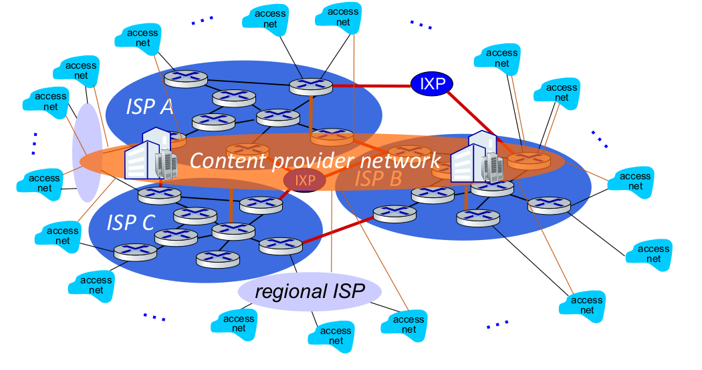

# Summary of Networking

{: .no_toc }

  

    Table of contents
  

  {: .text-delta }
1. TOC
{:toc}

# what is internet

## nut bolt view

- billions of connected devices
  - hosts - endpoints
- packet switches
  - forward packets
  - routers, switches
- communication links
  - fibre, copper, radio satellite
  - transmission rate - bandwidth
- networks
  - collection of devices, routers, link
    managed by organization
- internet - networks of networks
  - interconnected ISP's
- protocols are everywhere
  - controls sending and receiving of messages
- internet standards
  - **IETF** - Internet engineering task force
    - develops and promotes voluntary Internet standards, 
      in particular the technical standards that comprise 
      the Internet protocol suite
  - **RFC** - Request for comments, produced by IETF

## services view

- infrastructure that provides services to applications
- provides programming interfaces to distributed application

# what is a protocol

Protocols define the 
- format 
- order of messages sent and received among network entities
- and actions taken on message transmission, 
- receipt

# Internet structure

## network edge

- hosts - clients
- servers - in data centers

## access network, physical media

- wired, wireless communication links

## network core

- interconnected routers
- network of networks

# Host: sends packet of data

- host sending function
  - take application messages
  - breaks it into small chunks, known as packets of length $L$ bits
  - transmits packets into access network at transmission rate $R$

- same things:
  - network transmission rate
  - link transmission rate
  - link capacity
  - link bandwidth

- packet transmission delay $d_t$
  - time needed to transmit $L$ bit packet into link
  
$$
d_t = \frac{L}{R} \frac{(\text{bit})}{(\text{bit/s})}
$$

# Links - physical media

- **bit** - propagates between transmitter-receiver pair
- **physical link** - what lies between transmitter and receiver

 

- **guided media** - signal propagates in solid medium
- **unguided media** - signal propagates freely

## guided media

- twisted pair (TP)
  - two insulated copper wire
  - category 5 - 100 Mbps - 1Gbps Ethernet
  - category 6 - 100 Gbps Ethernet
- coaxial cable
  - bidirectional
  - broadband
    - multiple frequency channels on cable
    - 100 Mbps per channel
- fibre optic cable
  - 10-100 Gbps

## unguided media

- wireless radio
  - wireless LAN wifi
  - wide area - 4g
  - bluetooth
  - terrestrial microwave
  - satellite

# network core

- packet switching and circuit switching

## packet switching

- host breaks application layer messages into packets
- network forward packets form one router to another
- across links from source to destination
- two key networks core functions
  - forwarding/switching - local action
  - routing - global action

 

- store and forward
  - packet transmission delay $L/R$ seconds
    - to transmit a $L$ bit packet into a link at $R$ bps
  - store and forward 
    - entire packet must arrive to router before it can be transmitted

 

- queuing
  - occurs because packet arrives faster than they can be transmitted
  - if arrival rate exceeds the transmission rate queuing will occur
  - packets will be in queue, waiting to be transmitted on output link
  - packets can be dropped or if memory (buffer) in router fills up

## circuit switching

- end to end resources allocated to, reserve for a call between source and 
  destination
- dedicated resources - no sharing
- circuit segment is idle if not used by the call
- was used in telephone networks

### frequency division multiplexing (FDM)

- electromagnetic frequencies - divided into narrow bands
- each user gets its own band

### time division multiplexing (TDM)

- time divided into sots
- each call is allocated periodic slot

# how is it connected

- host connected to
  - access isp connected to
    - regional isp
        - content provider network link google
    - global isp connected by
        - ixp - internet exchange point

# how packet delay and loss occur

- packet queue in router buffer, waiting for their turn in transmission
- packet loss occurs when memory to hold queued packet fills up

 

## delay sources

$$
d_{nodal} = d_{proc} + d_{queue} + d_{trans} + d_{prop}
$$

- $d_{proc}$ - nodal processing delay
  - check bit errors
  - determine output link
  - typically less than microsecond

 

- $d_{queue}$ - queueing delay
  - time wasting at output link for transmission
  - depends on congestion level of the router
  - $a$ - average packet arrival rate in bits per sec
  - $L$ - packet size in bit
  - $R$ - transmission rate in bits per sec
  - traffic intensity = $La/R$
    - ~ 0 - small queuing delay
    - -> 1 - large queuing delay
    - \> 1 - inf queuing delay

 

- $d_{tarns}$ - transmission delay
  - $L$ - packet size in bit
  - $R$ - transmission rate in bits per sec
  - $d_{trans} = L/R$

 

- $d_{prop}$ - propagation delay
  - $d$ - length of the physical link
  - $s$ - propagation speed
  - $d_{prop} = d/s$

 

- **transmission delay** is the amount of time required to push all the packet's bits into the wire
- **queuing delay** is delays encountered by a packet between the time of insertion 
  into the network and the time of delivery to the address
- **processing delay** is the time it takes routers to process the packet header
- **propagation delay** is the time duration taken for a signal to reach its destination.

## throughput

- rate - bits per second - at which data is being send form transmitter to receiver
  - instantaneous - at given point
  - average - rate over longer period of time

# protocol layers, service models

## why layering

- to design complex systems
- explicit structure allows identification,
  relationship of system pieces
- modularization eases maintenance and updating the system

## layered protocol stack

- **application**
- **presentation**
- **session**
- **transport**
- **network**
- **data link**
- **physical**

{:width="400px"}

{:width="500px"}

{:width="500px"}
